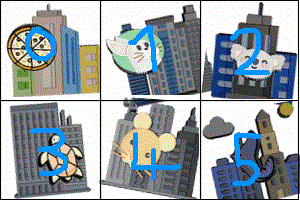

# roblox-funcaptcha
**NOTE:** This library is currently unmaintained. It may stay that way, or it might get updated again in the future. 
roblox-funcaptcha is a library designed to interface with roblox's funcaptchas.
### Usage
You can simply install the library using:
```
npm install roblox-funcaptcha
```
It is then available to require in your node js code.
```js
let fun = require("roblox-funcaptcha")
```
### API
`Promise<string> fun.getToken(publicKey: string, blob?: string)`  
This function will fetch a captcha token.  
A captcha token is used to get funcaptchas.  
NOTE: You are only able to fetch a maximum of 10 funcaptchas with one token.  

`Promise<Session> fun.getFuncaptcha(token: object | string)`  
Using this function, you are able to fetch a captcha challenge.  
The token argument must either be the parsed json from fun.getToken, or the raw token string (token property) from fun.getToken.  

##### Session
**Properties**  
`object Session.info` An object containing all the information about the captcha.  
`string Session.token` Internal.  
`string Session.challengeID` Internal.  
`string Session.gameVariant` The variant of the game; e.g. "horse" or "fish" for tile pick games  
`number Session.gameType` The type of game. 1 is the ball you have to rotate (not supported), 2 is unknown, and 3 is the tile picking game.  
`any Session.encrypted` Internal.  
`Array<string> Session.imgs` Internal.  
`string Session.breaker` Internal.  
`number Session.waves` The amount of waves that need to be completed.  
`string Session.key` Internal.  
`number Session.wave` The current wave, starts at 0.  
`Array<Object | Array> Session.answer_history` Internal.  
`string Session.originalToken` The original token from fun.getToken. Very useful for sending a login request. 
`boolean Session.supressed` If the captcha is supressed or not. Supressed captchas can be skipped entirely.

**Methods**  
`Promise<Buffer> getImage()`  
Returns the image of the current wave in a buffer in gif format.  
NOTE: Only call this function once per wave, or else things might break.  

`Promise<string> answer(answer: number)`  
Answers the current captcha wave, and returns the response from the API.  
* A response of `{"response": "not answered"}` means you haven't finished the captcha yet. There are still more waves left.
* A reponse of `{"response": "answered", "solved": false, "incorrect_guess": "", "score": 3 }` means you have finished the captcha, but failed it. You have answered incorrectly at least once.
* A reponse of `{"response": "answered", "solved": true, "incorrect_guess": "", "score": 3 }` means you have successfully finished the captcha. You have answered correctly and are good to go.  

NOTE: The answer MUST be a number from 0-5. Use the following image as a guide.  


### Example  
This example will get a captcha, and prompt you for an answer in the command line. Images will be written in the same folder as the script.
```js
let fs = require("fs")
let fun = require("./main")
let readline = require("readline")
let rl = readline.createInterface({
    input: process.stdin,
    output: process.stdout
})

function ask(question) {
    return new Promise((resolve, reject) => {
        rl.question(question, (answer) => {
            resolve(answer)
        })
    })
}

fun.getToken("476068BF-9607-4799-B53D-966BE98E2B81").then(async token => { 
    let captcha = await fun.getFuncaptcha(token)
    console.log(captcha.gameVariant)
    console.log(captcha.breaker)
    
    for(let x = 0; x < captcha.waves; x++) {
        fs.writeFileSync(`${x}.gif`, await captcha.getImage())
        console.log(await captcha.answer(parseInt(await ask("Answer: "))))
    }
    console.log("Done!")
})
```
